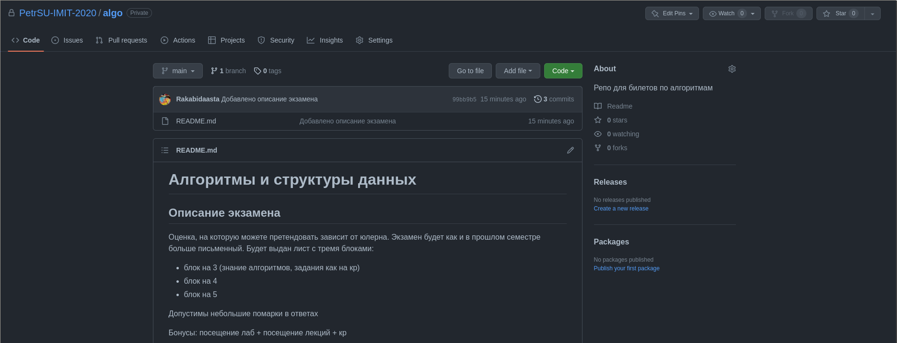
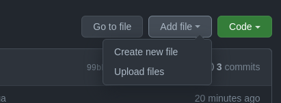
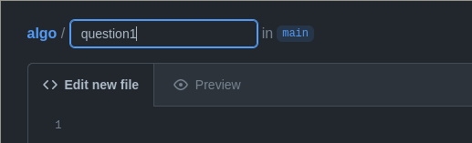
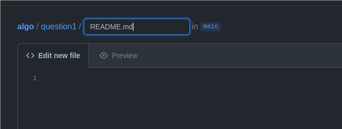
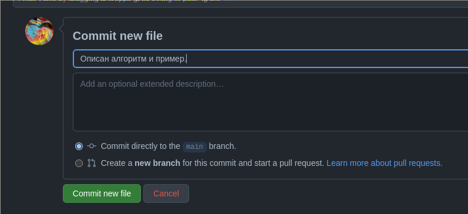

# Инструкция по добавлению билета

Прежде всего нужно не забыть, что каждый билет - отдельная папка. Билет №1 должен быть в папке question1, билет №2 - question2 и так далее.

Добавить файл можно, нажав по кнопке `Add file` и с нуля начать писать `Create new file` или загрузить с компа `Upload files`

> Замечание: если добавляете файлы с компа, они подгружаются в ту папку, в которой вы сейчас находитесь (пример с фото: добавится в корневую)

## Создание файла с нуля

Файл с билетом должен находится в questionI/README.md. Пример ввода пути к первому билету.

Итого, в пути к файлу должно быть введено `question1/README.md`

## Сохранение файла
После того, как билет написан, нужно сохранить его. Для этого нужно подписать коммит (краткая инфа): основые действия, что вы сделали, если сделали прям весь билет, то просто "Написан такой-то билет". 
Если в вас проснулась муза или вы хотите прям всё расписать, то можно использовать полное описание.

> **Не забывайте писать, что вы заменили или исправили.**

## Добавление фото
Если нужно загрузить фото, то сначала создаёте `question1/images/README.md` в котором можно написать "Папка с фотками" или бла-бла-бла. Затем загружаете через `Upload files` В ЭТОЙ ПАПКЕ

## Добавление скриптов
Если нужно загрузить код, то сначала создаёте `question1/scripts/README.md` в котором можно написать "Папка с кодом" или бла-бла-бла. Затем загружаете через `Upload files` В ЭТОЙ ПАПКЕ
